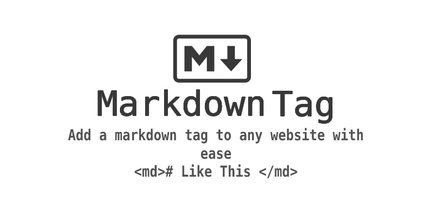

# Markdown-Tag

 

  

                                                                     

   

    The easiest way to add Markdown support to your website!
  
   
  <small> <b><i>Show your support!</i> </b></small>
   
   
  
   
  

## Example and usage

You can view a demo of Markdown Tag in use [here.](https://khanhduy1407.github.io/Md-Tag)

How to use <b><i>Markdown Tag</b></i>:

  Add support to any website to use markdown ANYWHERE with a simple tag! Like so -

            <md>
             # Markdown Support
               Awesomeness
             </md>

   include this [script](https://github.com/khanhduy1407/Md-Tag/blob/master/markdown-tag.js) at the <b>bottom</b> of your HTML document.
         
     

         

How to use <b><i>Markdown Tag</b></i> with <b>GitHub Styling</b>:

Instead of using a &lt;md> tag use
   
         <github-md># Example </github-md>

## Syntax

  This script uses Showdown to render Markdown - to read about the Showdown's Markdown syntax style click [here](https://github.com/showdownjs/showdown/wiki/Showdown's-Markdown-syntax)

How to use <b><i>CommonMark Syntax</b></i>:

 If you wish to use [CommonMark](https://spec.commonmark.org/current/) syntax instead of Showdown's use this [script](https://github.com/khanhduy1407/Md-Tag/blob/master/markdown-tag-commonmark.js) instead of the one above at the <b>bottom</b> of your HTML document.
         
     

How to use <b><i>GitHub Flavored Markdown Syntax</b></i>:
 
 If you wish to use [GitHub Flavored Markdown Spec](https://github.github.com/gfm/) syntax  use this [script](https://github.com/khanhduy1407/Md-Tag/blob/master/markdown-tag-Github.js) instead of the other script's above at the <b>bottom</b> of your HTML document. 
 
         
        
      
 
  <i>Note:</i> This options includes - Tables, GitHub Mentions & More.
             
          
## Known Issues 

- [ ] GitHub Flavored Markdown Syntax is not correct 100%
- [ ] GitHub Syntax Needs HTML Decoding Fixed 
- [ ] XSS Vunerability Fix

## Contributing 

Want to improve this? Create a pull request with detailed changes / improvements! If approved you will be added to the list of contributors of this awesome project!

Looking for a task to work on? Check the tasks that need improved in the [to-do](https://github.com/khanhduy1407/Md-Tag/blob/master/to-do.md) list.

See also the list of
[contributors](https://github.com/khanhduy1407/Md-Tag/graphs/contributors) who
participate in this project.

## License 

This project is licensed under the GPL License - see the
[LICENSE.md](https://github.com/khanhduy1407/Md-Tag/blob/master/LICENSE) file for
details.
